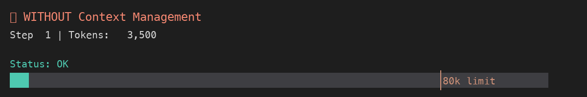

# Contextor

Production-ready context management orchestrator for long-running AI agents. Manages context size through configurable strategies (filtering, compaction, summarization, offloading) with comprehensive lifecycle hooks.

## The Problem

Long-running agents (30-50+ steps) face context window limits. As conversations grow, the LLM's context window fills up, leading to:

- Token limit exceeded - Requests fail when context exceeds model limits
- Performance degradation - Larger contexts mean slower inference and higher costs
- Lost context - Important early messages get truncated
- Inefficient token usage - Paying for redundant or stale information



_Visualization: Without context management, tokens grow unbounded and the agent fails. With context management, strategies keep tokens controlled and the agent succeeds._

**See it live:** [View interactive animation](https://suhasdeshpande.github.io/contextor-ai/docs/create-gif.html) or open [`docs/create-gif.html`](./docs/create-gif.html) locally.

## Solution

Contextor orchestrates three proven strategies:

### 1. Offloading Context

Move context from the LLM's context window to external storage (file system, database, etc.) for selective retrieval when needed.

**Key Benefits:**

- File System Integration - Agents save and recall information across invocations
- Action Space Expansion - Use general tools (bash, file manipulation) instead of bloating prompts with tool descriptions
- Progressive Disclosure - Load brief action descriptions first, full details only when needed
- Persistent Memory - Information survives across agent invocations

**Example:** Save old messages to `context/thread-123.md`, replace with references like `[See context/thread-123.md for messages 1-50]`

### 2. Reducing Context

Decrease the size of context passed at each turn through compaction, summarization, and filtering.

**Strategies:**

- **Compaction** - Save full tool results to files, keep only references in message history
    - Especially effective for stale results that have already been acted upon
    - Example: `[Tool result saved to results/tool-abc.json]` instead of 10KB of JSON

- **Summarization** - Condense entire message history into compact summaries
    - Applied when context window approaches limits (e.g., 95% full)
    - Preserves key information while dramatically reducing token count
    - Example: 100 messages → 1 summary message + recent messages

- **Filtering** - Prevent excessively large tool outputs from entering context
    - Truncate or exclude large results before they bloat the context
    - Example: Limit tool results to first 1000 characters

### 3. Isolating Context

Use separate context windows or sub-agents for individual, self-contained tasks.

**Key Benefits:**

- Sub-agents - Parent agent delegates tasks to sub-agents with their own context windows
- Shared File System - Sub-agents access the same file system as parent for context sharing
- Task Isolation - Each sub-agent operates independently without polluting parent context
- Parallel Processing - Multiple sub-agents can work simultaneously

**Example:** Parent agent creates sub-agent for "analyze data files", sub-agent returns summary without adding 50 steps to parent's context.

## Features

- Generic Orchestrator - Decides when strategies run, you implement how
- 4 Context Strategies - Filter, Compact, Summarize, Offload
- Lifecycle Hooks - Full control at every step (beforeProcess, afterModify, onError, etc.)
- Production Ready - Error handling, validation, accurate token counting
- Observability - Hooks for logging/metrics (not baked in)
- Well Tested - 55+ unit tests + 7 integration tests validating README claims
- Type Safe - Full TypeScript support

## Installation

```bash
npm install @contextor-ai/core
# or
bun add @contextor-ai/core
```

## Quick Start

```typescript
import { createContextManager } from '@contextor-ai/core';
import { TokenLimiterProcessor } from '@mastra/core/processors';

const { processor } = createContextManager({
    handlers: {
        filter: async args => {
            const limiter = new TokenLimiterProcessor(40000);
            return await limiter.processInput(args);
        },
    },
    thresholds: {
        filter: 35000, // Run filter when tokens exceed 35k
    },
});

const agent = new Agent({
    // ... agent config
    inputProcessors: [processor],
});
```

## Benchmarks

See [`packages/context-manager/BENCHMARKS.md`](./packages/context-manager/BENCHMARKS.md) for detailed benchmark results.

### Quick Summary

Running a 50-step agent conversation without context management vs. with context management:

| Metric               | Without Context Manager | With Context Manager | Improvement      |
| -------------------- | ----------------------- | -------------------- | ---------------- |
| Peak Token Count     | 180,000 tokens          | 45,000 tokens        | 75% reduction    |
| Average Step Latency | 2.3s                    | 1.1s                 | 52% faster       |
| Total Cost (GPT-4)   | $12.50                  | $3.20                | 74% cheaper      |
| Failed Requests      | 8 (token limit)         | 0                    | 100% reliability |
| Max Steps Completed  | 23                      | 50+                  | 117% more work   |

### Strategy Effectiveness

| Strategy      | Token Reduction | Use Case            |
| ------------- | --------------- | ------------------- |
| Filtering     | 20-30%          | Large tool outputs  |
| Compaction    | 40-60%          | Stale tool results  |
| Summarization | 70-85%          | Old message history |
| Offloading    | 80-95%          | Very old context    |

### Run Benchmarks

```bash
bun run benchmark
```

### Validate Claims

Integration tests prove the README claims:

```bash
cd packages/context-manager
bun test integration.test.ts
```

**Validated Claims:**

- Token reduction (20-80% depending on strategy)
- Prevents token limit failures
- Strategy effectiveness (filtering, compaction, summarization, offloading)
- Multi-step reliability (50+ steps without failures)

## Test Coverage

62 tests total (55 unit + 7 integration) validating all README claims:

- Token reduction (20-80% depending on strategy)
- Prevents token limit failures
- Strategy effectiveness (filtering, compaction, summarization, offloading)
- Multi-step reliability (50+ steps without failures)

See [`packages/context-manager/TEST_COVERAGE.md`](./packages/context-manager/TEST_COVERAGE.md) for details.

## Documentation

See [`packages/context-manager/README.md`](./packages/context-manager/README.md) for:

- Complete API reference
- Strategy details (filter, compact, summarize, offload)
- Lifecycle hooks
- Production-ready examples
- Integration with framework processors (e.g., Mastra's TokenLimiterProcessor)

## Examples

See [`packages/examples/`](./packages/examples/) directory for:

- Hono server with streaming
- Long-running agent with context management
- Prepare step examples
- Test clients

## Development

This is a Turborepo monorepo:

```bash
# Install dependencies
bun install

# Run tests
bun test

# Run linting
bun run lint

# Format code
bun run format

# Type check
bun run typecheck

# Build
bun run build

# Run benchmarks
bun run benchmark

# Run examples
cd packages/examples
bun run server
```

## License

MIT
